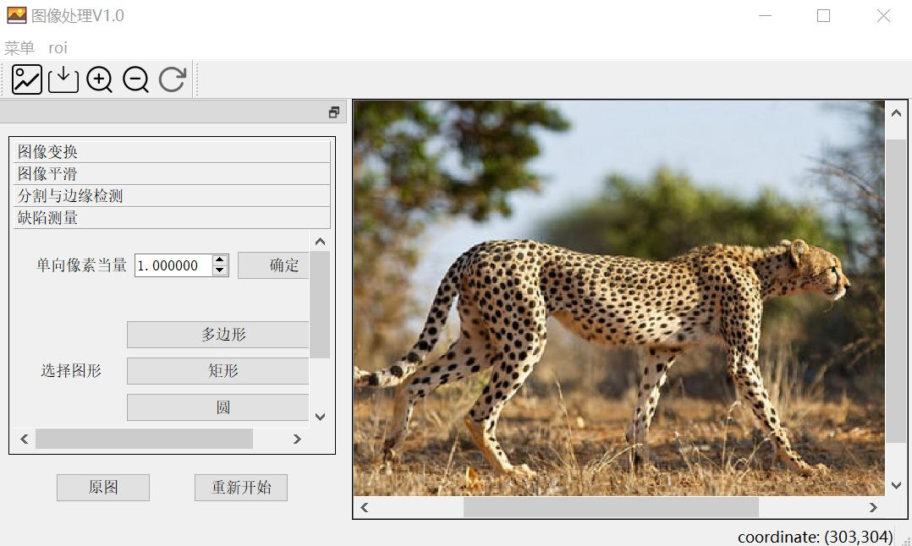

# qt_DefectSizer
本科毕设——用qt开发的缺陷尺寸测量软件。该软件是结合生产实际需求，开发出的实用的通用试件表面缺陷尺寸测量软件，实现了图像显示、图像处理、roi创建、相机接入、缺陷尺寸测量等功能。图像显示功能提供一个功能完善的图像显示框架，图像处理能实现包括图像变换、图像平滑、图像分割和边缘检测等功能。roi的创建能缩小需要处理图像尺寸，只关注感兴趣的区域，使得图像处理的效果更好。相机的接入能方便的将拍得的照片实时进行处理。缺陷尺寸测量是该软件的核心功能，即在对图像进行一系列处理后，可以对缺陷的面积进行测量。

  

# Release Version
[qt_DefectSizer](https://drive.google.com/file/d/181-SxfI8MhSEDbG5osGQHkHyBJB6Mcft/view?usp=sharing)

# Instructions
参考软件说明书
